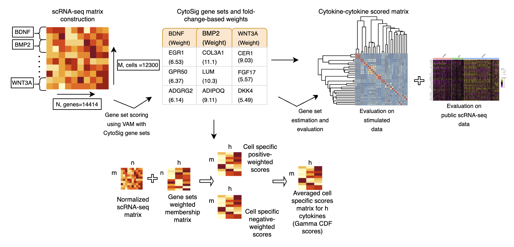

# SCAPE

## Abstract
Cytokine interaction activity modeling is a pressing problem since uncontrolled cytokine influx is at fault in a variety of medical conditions, including viral infections like COVID19, and cancer. Accurate knowledge of cytokine activity levels can be leveraged to provide tailored treatment recommendations based on individual patients' transcriptomics data. Here, we describe a novel method named Single cell transcriptomics-level Cytokine Activity Prediction and Estimation (SCAPE) that can predict cell-level cytokine activity from scRNA-seq data. SCAPE generates activity estimates using cytokine-specific gene sets constructed using information from the CytoSig and Reactome databases and scored with a modified version of the Variance-adjusted Mahalanobis (VAM) method adjusted for negative weights. We validate SCAPE using both simulated and real single cell RNA-sequencing (scRNA-seq) data. For the simulation study, we perturb real scRNA-seq data to reflect the expected stimulation signature of up to 41 cytokines, including chemokines, interleukins and growth factors. For the real data evaluation, we use publicly accessible scRNA-seq data that captures cytokine stimulation and blockade experiment conditions and a COVID19 transcriptomics data. As demonstrated by these evaluations, our approach can accurately estimate cell-level cytokine activity from scRNA-seq data. Our model has the potential to be incorporated in clinical settings as a way to estimate cytokine signaling for different cell populations within an impacted tissue sample.
